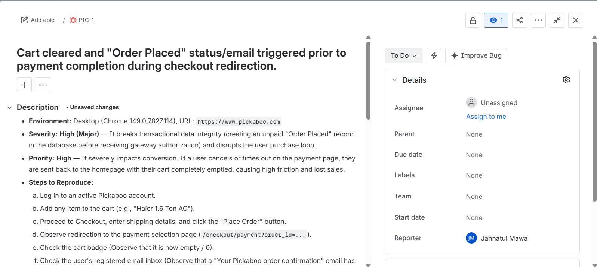

# Pickaboo Defect Log

This document details the critical transaction-state flaw identified during live exploratory testing of the Pickaboo checkout system.

---

## 🐛 Bug Report: Checkout Redirection Cart Preservation Flaw

*   **Jira Ticket ID:** PIC-1
*   **Bug ID:** PKB_BUG_001
*   **Bug Title:** [Checkout Redirection] Active cart is immediately cleared and unpaid order record/confirmation email is triggered prior to payment completion
*   **Environment:** Chrome Version 148.0.7778.168, Windows 11
*   **Severity:** Major | **Priority:** High

### Steps to Reproduce:
1.  Log in to an active, registered Pickaboo account.
2.  Add any item to the cart (e.g., "Walton 1.5 Ton Inverter AC").
3.  Proceed to the checkout page, complete the required shipping details, and click the **Place Order** button.
4.  Observe the redirection to the secure payment selection gateway page (`/checkout/payment?order_id=...`).
5.  *Observe backend triggers:* Check the cart badge in the top right, and check your registered email inbox **before** choosing or submitting any payment details.
6.  On the payment gateway screen, simulate a canceled transaction by clicking **Cancel** or **Back to Shopping**.

### Expected Result:
*   The active cart must remain preserved (not cleared) and no automated "Order Placed" confirmation email should be generated until a successful transaction verification is returned from the payment gateway.
*   Clicking "Cancel" or "Back to Shopping" should return the user safely to the checkout screen with the cart items completely intact so they can attempt payment again.

### Actual Result:
1.  The active cart is instantly cleared (cart badge drops to 0) the moment the gateway portal is launched, before any payment details are entered or submitted.
2.  An unpaid "Order Placed" confirmation email is immediately triggered to the user's inbox before payment is completed.
3.  Clicking "Back to Shopping" on the gateway page redirects the user to the homepage with a completely empty cart, forcing them to manually search and re-add items if the payment failed.

### Visual Evidence:

#### Real System Email Screenshot (Triggers Before Payment):

#### Jira Defect Ticket Details:

