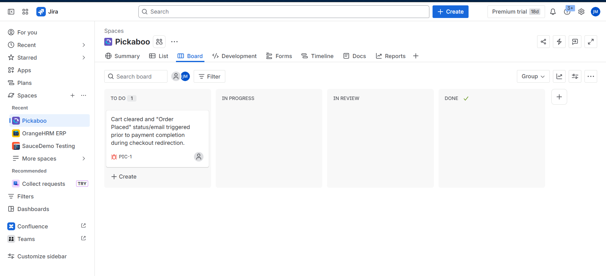

# Live Production Testing & Transaction Flaw Investigation: Pickaboo

This repository contains a comprehensive manual testing suite, complex functional test cases, and a critical transaction-state defect log executed against the live **Pickaboo** e-commerce platform.

Unlike static practice sandboxes, this project focuses on verifying complex, dynamic transactions, session states, and payment gateway boundaries on a live, production system.

---

## 🗺️ Project Navigation
Explore the individual modules of this testing project:
*   [**High-Level Test Scenarios**](./Pickaboo_Test_Scenarios.md): The 32 mapped scenarios covering Search, Cart persistence, EMI thresholds, and payment workflows.
*   [**Detailed Test Cases**](./Pickaboo_Test_Cases.md): In-depth test cases verifying Cart Merging logic, Payment Routing, and dynamic BDT 5,000 EMI threshold calculations.
*   [**Defect Logs & Bug Reports**](./Pickaboo_Bug_Reports.md): Detailed logs of the critical-severity "Cart Preservation Flaw" complete with real system email evidence.

---

## 🛠️ Jira Agile Defect Tracking
To simulate professional Agile sprint cycles, identified defects were logged directly into **Jira** under the project key **`PIC`**.

### Project Kanban Board

### Logged Defect:
*   **[PIC-1] Cart cleared and "Order Placed" status/email triggered prior to payment completion during checkout redirection.**
    *   *Severity:* Major | *Priority:* High
    *   [View Detailed Jira Ticket Screenshot](./jira-screenshots/pic_1_ticket_details.png)

---

## 📊 Test Execution Summary

I executed exploratory and regression testing across key user transaction paths. 

*   **Core Achievements:**
    *   Verified seamless **Cart Migration** when transitioning from guest states to registered user sessions.
    *   Validated mathematical calculations for **EMI tenures and convenience fees** (specifically verifying 4% transaction fees on premium purchases above BDT 5,000).
    *   Uncovered a **Critical Business Logic Bug** in the checkout payment routing system where user carts are cleared before payment is confirmed.

---

## 🔍 Key SQA Insights & Recommendations

1.  **Transactional Vulnerability:** The application currently clears the cart and triggers an order confirmation email *before* a successful transaction is confirmed by the payment gateway (SSLCommerz/bKash). If the user cancels the transaction, they are returned to the homepage with a cleared cart, violating basic transaction rollback rules.
2.  **Release Recommendation:** This critical transaction-state defect (**PIC-1**) should be resolved before any subsequent releases to prevent user confusion regarding unpaid orders and to avoid lost carts during checkout failures.
